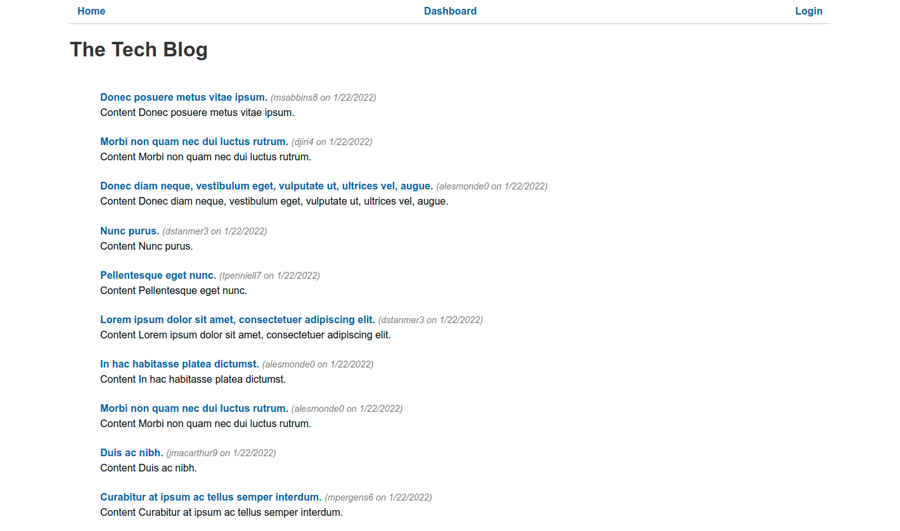

# tech-blog

## Description

A CMS style technical blog site

## Table Of Contents

- [tech-blog](#tech-blog)
  - [Description](#description)
  - [Table Of Contents](#table-of-contents)
  - [Local Installation (only if executing on local server/pc)](#local-installation-only-if-executing-on-local-serverpc)
  - [Usage for deployed Installation](#usage-for-deployed-installation)
  - [Usage for local Installation](#usage-for-local-installation)
  - [Questions](#questions)

## Local Installation (only if executing on local server/pc)

To install locally, clone this repository to your local environment.  This is a node application, so node must be installed.  MySQL must also be installed locally.  For mySQL installation see https://dev.mysql.com/doc/refman/8.0/en/installing.html.  If you need to install node, check out this link  https://nodejs.org/en/download/.  Once mySQL and node (and npm) are installed, attach to the repository root directory and update npm dependencies with the following commands:

* npm install bcrypt dotenv
* npm express express-handlebars express-session handlebars
* npm mysql2 nodemon sequelize connect-session-sequelize

Additionally you must execute the a database initialization script.  Attach to the root directory of the repository and connect to mySQL, then type the source command...

mysql> source db/schema.sql

THIS SQL SCRIPT SHOULD ONLY BE RUN ONCE TO INITIALIZE THE MYSQL DATABASE/SCHEMA AS A FIRST-TIME SETUP.

## Usage for deployed Installation

To execute the application using the Heroku deployed application, click the following link:

https://msdale-tech-blog.herokuapp.com/

The application interface should appear as "The Tech Blog" in your browser.

## Usage for local Installation

To execute the application locally, you have 3 command-line options.  From the root directory of the repository clone, type one of the following:

1.  *npm run start*           (starts the server and connects to the database)
2.  *npm run startover*       (starts the server and synchronizes database with sequelize models...all data lost)
3.  *npm run startseed*       (starts the server and synchronizes database with sequelize models...all data replaced)

The application interface will be available in your browser as:

http://localhost:3001

The application must remain running in the terminal until your done with it, at which time you can terminate it with a CTRL-C keystroke.

## Questions

Any questions, please contact Mark Dale.

My email address is: msdaledad@gmail.com
My github profile is https://github.com/msdale